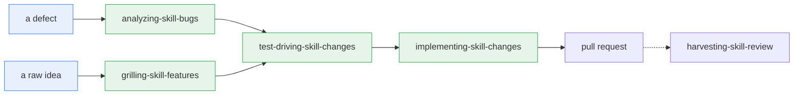
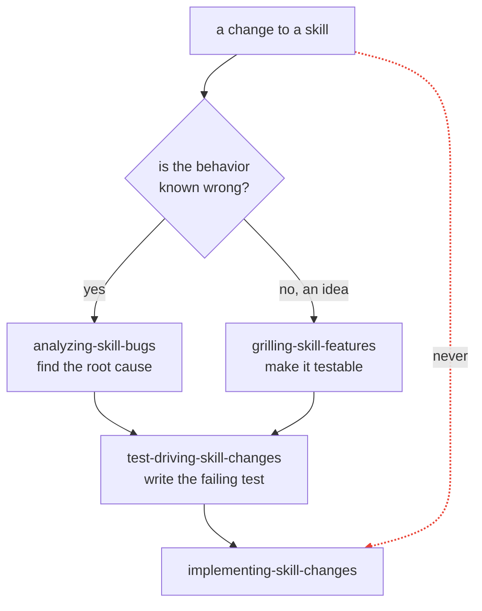

The repository ships skills for changing its own skills. They run in
order, each refusing to start until the previous one has produced its
output, so a fix cannot land before somebody has found the root cause and
written a test that fails.

The dotted edge marks `harvesting-skill-review` as outside the pipeline: it
runs after the pull request, on review feedback, rather than as a stage
the change has to pass through.

These live in
[`.claude/skills/`](https://github.com/opsmill/infrahub-skills/tree/main/.claude/skills),
with `.agents/` and `.codex/` symlinking to them so other assistants find
them in the directory they expect. They ship with the repository, not
with the installed plugin, so they exist only for somebody working in a
checkout.

## Two entrances

**`analyzing-skill-bugs`** takes a defect: a skill giving wrong guidance,
a grader that cannot fail, a bundled script misbehaving, a registration
surface that has drifted. It produces a root cause, before any test and
any fix.

**`grilling-skill-features`** takes a raw idea and stress-tests it through
nine lenses until it is a design a grader can actually assert. Who hits
this and when. New rule or new skill. Which skill and which category
prefix. What a grader can check. What the violating near miss looks like.
What eval prompt exercises it. What it contradicts. Ground truth. Scope.

Pick by whether the behavior is known-wrong. A defect goes left, an idea
goes right. Either way the next stop is the same: the failing test comes
before the fix, and the dashed edge below marks the shortcut around it as
barred rather than as a third route.

## Writing the failing test

**`test-driving-skill-changes`** writes the test and proves it fails,
before any fix exists. It routes on defect class:

| Defect class | Test surface |
| --- | --- |
| Guidance (the skill's prose) | An `eval.yaml` task plus a check function in `graders/<name>/lib.py` |
| Grader | A pytest under `tests/graders/` |
| Bundled script | A pytest under `tests/scripts/` |

A guidance test runs against **four fixtures**, and the fourth is the one
that matters:

1. **Compliant.** The rule is followed.
2. **Compliant variant.** Also followed, but with a different field order
   or a synonym, so the check is not matching one exact string.
3. **Violating.** The rule is broken.
4. **Violating near miss.** The output satisfies whatever keyword the
   check looks for while still breaking the rule.

That last fixture is what stops a grader that cannot fail. A check that
passes all four is not testing the rule, it is testing for a word.

## Making it pass

**`implementing-skill-changes`** runs last. It makes the failing test
pass, runs the repository's gates, sweeps every layer the change
contradicts, adds the changelog fragment, and pushes.

The sweep is the step people skip. A rule change that leaves the old
claim standing in `examples.md`, in a grader comment, or in a docs page
has not landed; it has forked.

## The handoff file

Stages pass work through one file per change at
`.skill-change-<key>.md` in the repository root. It is never committed.

A stage may not proceed past a handoff file missing any of `Key`,
`Branch`, `Defect class`, `Minimum change rung`, `Docs impact`, `Sweep
terms`, or a non-empty `Test plan`. Finding one missing, it names the
field and stops there rather than guessing a value forward.

`Docs impact` and `Sweep terms` are both satisfied by `none`. An entrance
that looked and found nothing has answered; an entrance that never looked
has not, and the two are indistinguishable once the field is blank.

## The ground truth ladder

Any claim about how Infrahub behaves gets checked, and checked at a
version. The ladder stops at the first rung that answers:

1. A local `opsmill/infrahub` checkout, read with `git show <tag>:<path>`.
   Never check out the tag, never touch the working tree.
2. The installed `infrahub-sdk` in the project virtualenv, for SDK
   surface claims.
3. Mark the claim `UNVERIFIED` and carry on.

`UNVERIFIED` is an accepted outcome. Guessing is not. A defect entirely
inside this repository makes no claim about Infrahub, so it records
`n/a` and moves on.

This exists because encoding a lesson that was already fixed upstream
rots the skill. Verify against current source before writing a rule from
a war story.

## After the pull request

**`harvesting-skill-review`** turns review threads on a pull request into
durable rules. It is not part of the pipeline and runs on its own, after
the fact. It reports first and edits only with approval, and its governing
instruction is to refine rather than accrete: a review lesson usually
belongs inside an existing rule, not in a new one beside it.

## Shared references

**`skill-pipeline-common`** is not invoked directly. It holds the handoff
file format and the ground truth ladder, and the four pipeline stages link
to it when they need them.

## Go deeper

- [`dev/guides/running-evals.md`](https://github.com/opsmill/infrahub-skills/blob/main/dev/guides/running-evals.md)
- [`dev/guidelines/`](https://github.com/opsmill/infrahub-skills/tree/main/dev/guidelines)
- [`dev/guidelines/minimum-change.md`](https://github.com/opsmill/infrahub-skills/blob/main/dev/guidelines/minimum-change.md)
- [Anatomy of a skill](./anatomy-of-a-skill.mdx)
