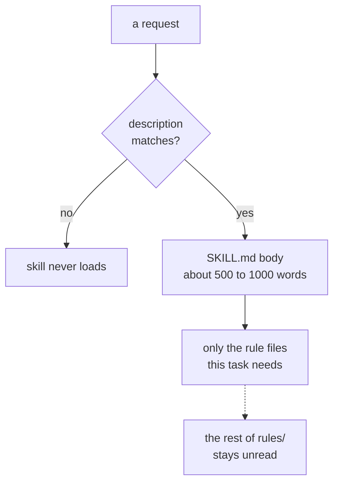

Infrahub Skills gives an AI assistant domain-specific knowledge about the Infrahub platform. Each skill is a structured set of Markdown files (rules, examples, and references) that the AI reads at the point it's needed. The assistant matches each user request to the relevant skill automatically, loads only the context required for that task, and applies the rules embedded in the skill.

## What a skill is

A skill is a directory containing a `SKILL.md` entry point, modular rule files, examples, and references. Skills are designed to load progressively so they don't exhaust the AI's context window:

- **Metadata** (always loaded, ~100 words): the name and description in `SKILL.md` frontmatter. This is the triggering mechanism: if the description matches the user's request, the AI activates the skill and reads the full `SKILL.md`.
- **SKILL.md body** (loaded on activation): overview, workflow steps, and pointers to supporting files. Tells the AI what to do and where to look next.
- **Supporting files** (loaded on demand): individual rule files organized by category, `examples.md`, `reference.md`. The AI reads only the files relevant to the current task.



The dotted edge marks what does not happen: most of a skill's rule files
are never read on a given task. The description match above is a real
gate, not a formality; most requests never trigger the skill at all.

```text
skills/infrahub-managing-schemas/
├── SKILL.md                      # Entry point: overview and workflow
├── examples.md                   # Concrete schema examples
├── reference.md                  # Attribute types, relationship kinds
├── validation.md                 # Schema validation rules
└── rules/
    ├── _sections.md              # Category index for this skill
    ├── naming-conventions.md     # Naming convention rules
    ├── relationship-identifiers.md  # Relationship identifier rules
    ├── hierarchy-setup.md        # Parent/child hierarchy rules
    └── ...
```

## How skills are triggered

The AI infers whether a skill is relevant by matching the user's request against each skill's description. When a user asks "create a schema for VLAN management," the AI recognizes this matches the Schema Manager skill, activates it, and reads its `SKILL.md` to understand how to proceed.

Agents with plugin support let you invoke a skill by name:

```text
/infrahub:managing-schemas
/infrahub:managing-objects
/infrahub:managing-checks
```

Where an agent has no plugin mechanism, activation is passive: the AI finds skill files through its normal file context and applies them when the request is relevant. No explicit invocation is needed.

## Auto-detection (plugin installs)

When installed as a plugin, a `SessionStart` hook runs on project open. The hook checks for Infrahub project markers:

- `.infrahub.yml`
- `infrahub.toml`
- Schema files containing `version: "1.0"` with `nodes:` or `generics:` keys

If markers are found, the hook outputs context that tells the AI which skills are available and how to use them, before you type anything.

With other AI tools (npx or manual copy), discovery happens because the skill files are present in the project directory. The AI finds them through its normal file context when the user's request is relevant.

## The infrahub-common library

A shared set of references available to all skills. Skills reference these files rather than duplicating the content, which keeps rules consistent across the entire package.

Contents:

- **GraphQL query syntax**: how to structure queries for Infrahub's API
- **`.infrahub.yml` configuration format**: how to register checks, generators, transforms, and artifact definitions
- **YAML structure**: correct structure for schema and object definition files
- **Profiles and Object Templates**: when to use shared default values (profiles) vs. cloneable object structures (templates), and their mechanics
- **Shared rules**: git integration patterns, protocol/generated file handling, Python environment detection, and display label caching

## Context efficiency

Each skill is self-contained but references shared resources by file path rather than embedding them. When the AI activates a skill, it loads:

1. The `SKILL.md` body (~500–1000 words)
2. Only the rule files relevant to the current task
3. Shared references from `infrahub-common` as needed

This progressive loading means a simple task like "add an attribute to this node" loads far less context than a complex task like "design a new schema domain with generics and hierarchies." The AI manages this automatically.

## Supported AI tools

Which tools support auto-detection and direct invocation, and how to
install for each, is in
[Installation & Setup](./installation-setup.mdx#supported-ai-tools).

## Building or changing a skill

Wondering how a skill is put together, or want to add or edit one? See
[Anatomy of a skill](./contributing/anatomy-of-a-skill.mdx).
