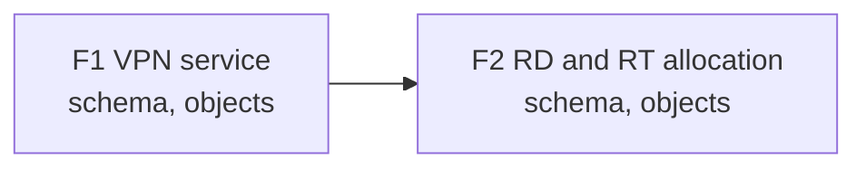
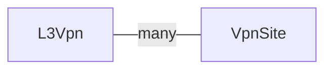

Skill: `infrahub-designing-models`

The Model Designer works out what to model before any schema exists. It reads the diagrams, spreadsheets or documents you have, then interviews you one question at a time: first why the data matters, then what is delivered or ordered, and only then the data itself. Each question comes with a recommended answer and the reason for it. The result is a design brief that the managing skills build from: the [Schema Manager](./managing-schemas.mdx) first, then the skill for each other artifact the brief lists.

## When to use

- You know what is broken or missing, but not yet which node kinds you need
- You have diagrams, inventory exports or a requirements document to turn into a design
- A request spans several domains, such as a fiber plant, DWDM channels and a wavelength service, and needs to be split
- A design brief exists and needs another feature or a changed decision

## What it produces

`design-brief.md`, in your repository's existing design-document location or `docs/designs/<design-slug>/` by default. It holds:

- **Business and service**: who uses the data, the incident it prevents, what is ordered, and the service lifecycle
- **Features**: one row per feature in build order, with the artifacts each one needs (schema, objects, generator, check, transform, menu), its dependencies, and a portable handoff for any downstream workflow
- **Data model sketch**: for the first feature, each node kind with how it is identified, its key attributes, its peers, its source of truth, its owner, and where each fact came from
- **Mechanisms**: whether each behavior is a computed attribute, a resource pool, a check, a transform or a generator, and why
- **Plan map and model map**: two Mermaid diagrams drawn from the Features table and the sketch, showing the build order and how the F1 node kinds relate
- **Decision log and open items**: every decision tagged as stated by you, accepted from a recommendation, or open, and every unknown with who owes the answer

It writes no schema YAML.

## Example prompts

- "We want our L3VPN service in Infrahub. Where do we start?"
- "Here's our sites spreadsheet and the out-of-band diagram. What should the model look like?"
- "Model our whole optical network: fiber plant, DWDM channels and customer wavelengths"
- "Add a peering feature to our existing design brief"

## Key rules enforced

- **One question at a time, with a recommendation**: each message is a single question with two to four options, one marked as recommended, and the basis for it with its strength
- **Your files are evidence**: every file you provide is listed in the brief, and model rows built from it name it as their source
- **Split before modelling**: a scope that covers several domains or many node kinds is split into ordered features, and only the first is modelled in depth
- **No invented values**: a node kind's identity, source of truth or owner is either answered or recorded as an open item
- **Provenance on every decision**: the brief separates what you decided from what you accepted on the skill's recommendation
- **Maps that match their tables**: the plan map and the model map show exactly the features, dependencies, node kinds and peers in their tables, nothing more

## Common mistakes it catches

- Writing a schema before anyone has asked what service it models
- A model built around devices with no service object
- Two systems both treated as the source of truth for the same data
- "Sensible defaults" that look decided but were never confirmed
- A generator chosen for a value that a computed attribute on the same node would give

## Example: an L3VPN service

You ask: "We want our L3VPN service in Infrahub. Where do we start?" You attach `vpn-customers.xlsx`, an export with one row per VPN and its sites.

### The interview

Each message is one question. The skill reads your file first, so the first business question already uses what is in it:

```markdown
**Q1 (business):** Which task fails today because VPN data is wrong or missing?

- A. Provisioning: a new site gets a route distinguisher that is already in use  **(Recommended)**
- B. Troubleshooting: nobody can tell which PE serves which customer site
- C. Billing: VPNs stay billed after they are decommissioned

**Basis:** vpn-customers.xlsx has duplicate values in its rd column (strong)
```

You answer "A". Later, a service question separates what the customer orders from what the network team derives:

```markdown
**Q3 (service):** What does the customer order?

- A. One VPN, with sites added to it over time  **(Recommended)**
- B. Each site as its own order, grouped into a VPN afterwards
- C. Both, depending on the customer

**Basis:** every row in vpn-customers.xlsx is one VPN with a site list (strong)
```

You answer "A, but the route targets are ours to choose, not the customer's". The skill records the first half as an accepted recommendation and the second as your own decision.

### The brief

The request covers the VPN service and the allocation of route distinguishers and route targets, so the skill splits it into two features and models only the first in depth. An excerpt of `docs/designs/l3vpn/design-brief.md`:

````markdown
## Features

| ID | Feature | Intent | Scope boundary | Artifacts | Depends on | Status | Handoff |
| --- | --- | --- | --- | --- | --- | --- | --- |
| F1 | VPN service | One object per ordered VPN, with its sites | L3Vpn, VpnSite | schema, objects | - | planned | Design and implement the L3Vpn and VpnSite model sketched below, then populate it from the customer export. |
| F2 | RD and RT allocation | No duplicate distinguishers or targets | RD pool, RT pool | schema, objects | F1 | planned | After F1, design the RD and RT pools and populate the initial allocations using this brief's decisions. |



## Data model sketch

| Feature | Node kind | Identified by | Key attributes (value class) | Peers (cardinality) | Source of truth | Owner | Evidence |
| --- | --- | --- | --- | --- | --- | --- | --- |
| F1 | L3Vpn | customer + vpn_name | bandwidth (stated) | VpnSite (many) | Infrahub | Network team | vpn-customers.xlsx:vpn_name |
| F1 | VpnSite | vpn + site_code | access type (stated) | L3Vpn (one) | Infrahub | open: O1 | vpn-customers.xlsx:site_code |



## Decision log

| # | Decision | Tag | Basis |
| --- | --- | --- | --- |
| 1 | The customer orders one VPN, and sites are added to it | recommended | Every row in vpn-customers.xlsx is one VPN with a site list (strong) |
| 2 | The network team chooses route targets, not the customer | stated | |
| 3 | Who owns site records once a VPN is live | open | O1 |

## Open items

- O1: Who owns site records once a VPN is live? (owner: unknown, network or service desk)
````

### The maps

The brief draws each table as a map, so the plan and the model can be read at a glance. The tables stay the source, and the skill checks that each map agrees with its table. The plan map shows the build order and what each feature produces:


The model map shows the F1 node kinds and how they relate:


The next step is to take the F1 handoff into the team's existing specification, planning or implementation workflow. If the team has no established workflow, each artifact in F1's `Artifacts` cell goes to its managing skill, in the listed order. Here F1 lists `schema, objects`: the [Schema Manager](./managing-schemas.mdx) writes the L3Vpn and VpnSite schema, then the [Object Manager](./managing-objects.mdx) loads the VPNs from the customer export.

### From artifact to skill

| Artifact in the brief | Skill that builds it |
| --- | --- |
| `schema` | [Schema Manager](./managing-schemas.mdx) |
| `objects` | [Object Manager](./managing-objects.mdx) |
| `generator` | [Generator Manager](./managing-generators.mdx) |
| `check` | [Check Manager](./managing-checks.mdx) |
| `transform` | [Transform Manager](./managing-transforms.mdx) |
| `menu` | [Menu Manager](./managing-menus.mdx) |

A later feature that lists `schema, generator`, for example, goes to the Schema Manager and then the Generator Manager.

## Using it with your workflow

The brief does not assume a particular framework. Paste each feature's handoff into your existing specification, planning, ticketing or implementation workflow in dependency order. For a spec-driven flow, use the handoff as the input to its Specify step. See [Spec-Driven Development](../spec-driven-development.mdx).

## Not sure this is the right skill?

See [Which skill do I use?](../choosing-a-skill.mdx) for how the Model Designer differs from the Schema Manager.
