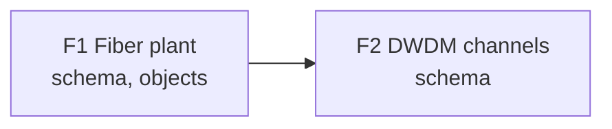
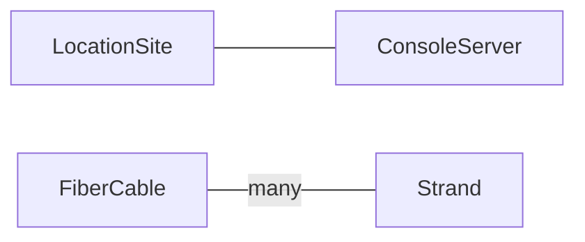

# Design Brief Format

The single home for the brief's location, sections and
tables. The rules link here; none of them restate it.

## Location

One brief per design, named `design-brief.md`. Follow an
existing design-document location when the repository has
one. Otherwise write
`docs/designs/<design-slug>/design-brief.md`.

`<design-slug>` is two to four lowercase words joined by
hyphens, such as `oob-network`. Extending a design
edits its existing brief; it never starts a second one.

## Sections

These `##` headings, spelled and ordered exactly like this:

1. `## Summary`: the problem, the intended outcome, and
   what is not decided yet. Three to five sentences.
2. `## Inputs`: the files the user provided, as a table,
   or the word `none`.
3. `## Business`: who uses the data, the incident it
   prevents, and what is out of scope.
4. `## Service`: what a customer or internal team
   orders, what the requester decides compared with
   what the network team derives, and the lifecycle
   states with who moves each one.
5. `## Features`: always present, one row per feature,
   then the plan map.
6. `## Data model sketch`: the node kinds of F1, then
   the model map.
7. `## Mechanisms`: for each behavior, a computed
   attribute, a resource pool, a check, a transform or
   a generator, and why.
8. `## Decision log`: every decision and its provenance.
9. `## Open items`: what is not known, and who owes it.

## Inputs table

```markdown
| File | Taken from it |
| --- | --- |
| sites.xlsx | site_code identifies each site; country becomes the parent |
| oob-diagram.drawio | Two console servers per site and the devices cabled to each port |
```

One row per file, named as the user named it, including
files pasted into the conversation.

## Features table

```markdown
| ID | Feature | Intent | Scope boundary | Artifacts | Depends on | Status | Handoff |
| --- | --- | --- | --- | --- | --- | --- | --- |
| F1 | Fiber plant | Know which strand runs where | Site, FiberCable, Strand | schema, objects | - | planned | Design and implement the fiber plant model, then populate its initial objects, as designed in F1 of docs/designs/metro-optical/design-brief.md. |
| F2 | DWDM channels | Allocate channels without clashes | OpticalChannel, channel pool | schema | F1 | planned | After F1, design the channel model and allocation pool, as designed in F2 of docs/designs/metro-optical/design-brief.md. |
```

- `ID` is `F1`, `F2`, ... in build order. An ID never
  changes once a spec refers to it.
- `Artifacts` is an ordered, comma-separated list from
  exactly these values: `schema`, `objects`, `generator`,
  `check`, `transform`, `menu`. `schema` comes first
  whenever it is listed, because everything else reads
  it.
- Each artifact is built by one skill:

  | Artifact | Skill |
  | -------- | ----- |
  | `schema` | `infrahub-managing-schemas` |
  | `objects` | `infrahub-managing-objects` |
  | `generator` | `infrahub-managing-generators` |
  | `check` | `infrahub-managing-checks` |
  | `transform` | `infrahub-managing-transforms` |
  | `menu` | `infrahub-managing-menus` |

- `Depends on` names the earlier features a feature
  needs, or `-` when it needs none. It is never empty,
  and never names a later or unknown ID. A later
  feature can be independent; write `-` rather than a
  dependency it does not have.
- `Status` starts as `planned`.
- `Handoff` states the outcome, scope, artifacts and
  dependencies, and names the brief's path and the
  feature ID, so the downstream workflow reads the
  details from the brief. It does not name a framework
  command. The user can paste it into their existing
  specification, planning, ticketing or implementation
  workflow, together with the brief it names.

## Plan map

A Mermaid graph right after the Features table, so a
reader sees the build order at a glance. It is drawn
from the table, and the table stays the source: change
the table first, then redraw the map.

- One node per feature, labelled with its ID, its name
  and its artifacts.
- One arrow from each feature in `Depends on` to the
  feature that depends on it. A feature with `-` has no
  incoming arrow.
- Break a label over two lines inside the quotes, never
  with `<br>`.



## Data model sketch table

```markdown
| Feature | Node kind | Identified by | Key attributes (value class) | Peers (cardinality) | Source of truth | Owner | Evidence |
| --- | --- | --- | --- | --- | --- | --- | --- |
| F1 | LocationSite | site_code | name, country (imported) | ConsoleServer (many) | Sites sheet | Facilities team | sites.xlsx:site_code |
| F1 | FiberCable | cable ID | length (stated) | Strand (many) | Infrahub | open: O1 | answer Q5 |
```

- Value classes: `stated` (the requester gives it),
  `pool` (allocated from a resource pool), `computed`
  (derived from other values), `imported` (read from
  another system).
- `Source of truth` is the system that is authoritative
  for the node kind. `Evidence` is where you learned the
  row's facts: `file:column`, `file:element`, or
  `answer Q<n>`.
- `Peers` names each peer node kind spelled exactly as
  its `Node kind`, followed by the cardinality:
  `Strand (many)`.
- A value nobody knows is written `open: O<n>`, pointing
  at a real entry in Open items.

## Model map

A Mermaid graph right after the sketch table. Like the
plan map, it is drawn from the table and the table stays
the source.

- One node per node kind in the sketch, labelled with
  the node kind.
- One line between a node kind and each peer in its
  `Peers` cell. Direction does not matter; a line the
  table does not have is a mistake.



## Decision log table

```markdown
| # | Decision | Tag | Basis |
| --- | --- | --- | --- |
| 1 | Console ports are identified by server and port number | stated | |
| 2 | Channel numbers come from a number pool | recommended | Pool avoids clashes; you allocate by hand today (strong) |
| 3 | Who approves new OOB sites | open | O2 |
```

- `Basis` on a `recommended` row is the reason you
  recommended it. On an `open` row it is the open item
  that tracks the question, `O<n>`, which must be a real
  entry in Open items.

## Open items

```markdown
- O1: Who owns cable records? (owner: unknown, field operations or planning team)
- O2: Who approves new OOB sites? (owner: network operations)
```
