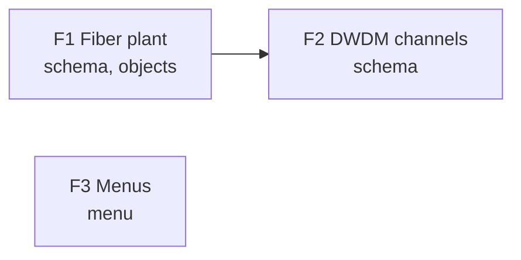
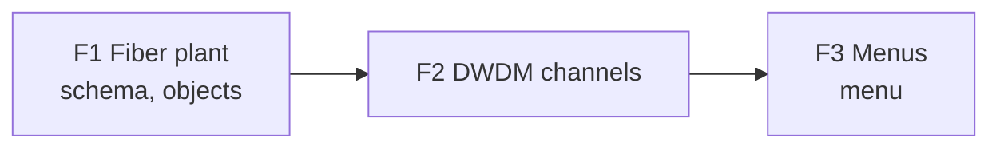

# Rule: brief-maps-match-tables

## The rule

The brief carries two Mermaid maps, each drawn from the
table above it and agreeing with it exactly:

1. **Plan map**, after the Features table: one node per
   feature showing its ID and artifacts, and one arrow
   from each feature in `Depends on` to the feature that
   needs it.
2. **Model map**, after the data model sketch: one node
   per node kind, and one line for each peer in the
   `Peers` column, with nothing extra.

The tables are the source. Write or change a table
first, then draw its map from it. Never add a feature,
an arrow, a node kind or a line in a map that its table
does not have.

## Why it matters

A reviewer understands the build order and the shape of
the model faster from a picture than from two tables.
But a picture next to a table is a second copy of the
same facts, and a copy nobody checks drifts: a feature
gets a new dependency in the table while the map still
shows the old order, and the reader trusts the map.
Agents and tools that act on the brief read the tables,
so a map that disagrees misleads only the people
reviewing it.

## How to apply

- Draw the maps last, after the tables are final.
- Spell node kinds in the model map exactly as in the
  `Node kind` and `Peers` columns.
- Break a label over two lines inside the quotes, never
  with ` `.
- Format and examples:
  [../references/brief-format.md](../references/brief-format.md).

## Correct

A plan map for a table where F2 depends on F1, and F3
needs nothing:

## Incorrect

The table says F3 needs nothing, but the map draws a
dependency, and F2's label drops its artifacts.

## Common mistakes

| Mistake | Why it is wrong |
| ------- | --------------- |
| Editing the map but not the table | The tables are what tools read; the change is lost |
| An arrow pointing from the dependent feature | The build order reads backwards |
| A peer shortened in the map (`AccessPoint` for `WirelessAccessPoint`) | The map no longer names the node kind in the table |
